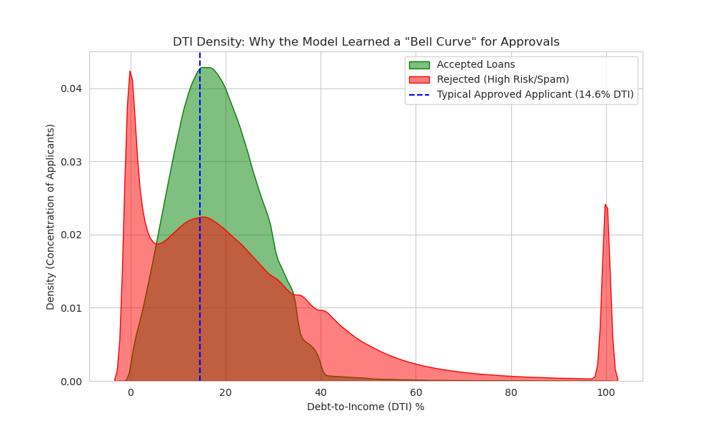

# Strategic Credit Risk & Automated Underwriting Pipeline

This repository features a production-oriented machine learning system designed to handle massive financial datasets, filter loan applications at scale, and predict default probability.

### 🚀 System Architecture
The pipeline is divided into two distinct machine learning stages:
1.  **The Gatekeeper Model:** An XGBoost classifier trained on ~28M records. It handles extreme class imbalance (98.8% rejection rate) to automate initial loan triage.
2.  **The Default Probability Model:** A risk-assessment model specifically for accepted applicants, predicting the likelihood of "Charged Off" vs "Fully Paid" outcomes.

### 🛠️ Technical Highlights
* **Big Data Engineering:** Utilized **NVIDIA RAPIDS (cuDF)** for GPU-accelerated processing, enabling the manipulation of a 3.6GB+ dataset that exceeds standard CPU memory efficiency.
* **Imbalance Management:** Implemented strategic sampling and weight adjustments to handle the high sparsity of accepted loans (approx. 1.1% of the total dataset).
* **Deployment Readiness:** All models are serialized in JSON format with independent feature-list tracking in the `Models/` directory to ensure environment-agnostic inference.

---

### 📊 Model Performance & Financial Logic

#### 1. The Gatekeeper (Approval Logic)
The Gatekeeper was designed to filter "Spam" or unqualified applications. The model learned a "Bell Curve" for approvals based on Debt-to-Income (DTI) ratios.

*Insight: The model successfully identified that the highest density of approvals occurs at a 14.6% DTI, strictly rejecting applicants with DTIs above 40%.*

#### 2. Default Prediction (Risk Assessment)
Once an application is "Accepted" by the Gatekeeper, it is passed to the Default Model. This model evaluates the risk of a loan going into default.

*Note: This stage focuses on high-precision risk assessment for the 268k loans that reached the final stage.*

---

### 📁 Project Structure
* `Gatekeeper_Model.ipynb`: Massive-scale data cleaning, GPU-accelerated merging, and initial classification.
* `Default_Probability_Model.ipynb`: Secondary risk modeling, feature engineering for "Accepted" loan nuances, and model serialization.
* `Models/`: Contains the production-ready `.json` model files and feature mappings.